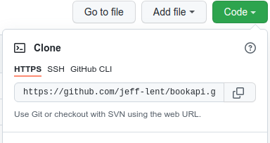

# Book API Exercise
## Learning Test Driven Development
_____________________
### Scenario
You've been hired at BigCorp International to help them write the API for their exciting new Book Tracker application.  Since BigCorp International is launching this product as a small tech demo to start with there is no need to store anything in a database, you can just keep everything in memory.  Also you don't need to worry about authentication, session tracking or anything else that multi user applications use.  Other teams at BigCorp will work on all that for you.

### API Specification

A `Book` should have the following model:

| Book   |        |
|--------|--------|
| title  | String |
| author | String |
| length | int    |
| year   | int    |

The `ReadingList` should have the following model:

| ReadingList |               |
|-------------|---------------|
| getBook()   | Book(s)       |
| addBook()   | void          |
| deleteBook()| void          |
| getBookByRating() | Book(s) |
| numberRead()| int
| dateRead    | String        |
| rating      | int           |

`addBook()` needs to take three parameters:

1. A `Book` object
2. A `dateRead` String
3. A `rating` integer

`getBookByRating()` will take an integer parameter that equals a rating number.  This method will return a list of all the books that have that rating.

`ratings` will be between 1 and 5.

`getBook()` and `getBookByRating()` will return a String that is formatted like this:

```JavaScript
{
    'The Hobbit by J.R.R. Tolkein, 320 pages, 1937 read on January 1, 2020, *****',
    'Alices Adventures in Wonderland by Lewis Carroll, 544 pages, 1865, read on May 22, 1992,****'
}
```

### Your Job

As the lead engineer on the project, your job is to implement the following user story, following the TDD workflow:

- Write failing tests before writing any code (commit after this step)
- Only write code in response to failing tests
- Make tests pass with the simplest code possible (commit when tests pass)
- After getting each tes to pass, refactor your code and tests to be as concise as possible (commit and push after refactor)

## Instructions

***Be sure to fork:***


***then Clone:***



***this repository!***

When you are finished with the exercise, [commit](https://www.atlassian.com/git/tutorials/saving-changes) and [push](https://www.atlassian.com/git/tutorials/syncing#git-push) your work!

You will know you have forked and pushed properly if you see your work in Github under your github account!

### User Story

- As an avid reader
- I want to have list of books I've read
- So that I can keep track of everything I've read!

### Acceptance Criteria

1. Given that I visit the site, when I first start, I expect my list to be empty.
2. Given that I have an empty list, when I add the first book to my list then I expect `numberRead` to return 1.
3. Given that I have an empty list, when I add additional books to the list I expect the `numberRead` to return the total number of books in my list.
4. Given that I have a book in my list, when I call `removeBook("<title>")` with "title" representing the title of my book that I want to delete, then when I call `getBooks()` the book I deleted should no longer be there.
5. Given that I have an empty list, when I add a new book I expect `getBooks()` to return a list of books that includes the book I added.
6. Given when I call `getBooksByRating()`, I should return a list of books that all have that rating.


